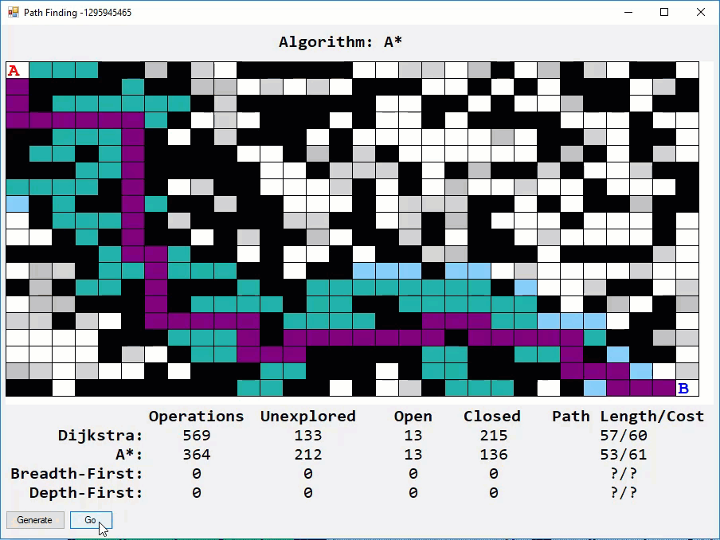

# PathFinding

C# Windows Forms application demonstrating several common path finding algorithms traversing a 2D maze.

Uses Dijkstra, A*, Breadth First search, and Depth First search to find a path from A to B. The cells of the maze are randomly weighted so that the direct path is not always the cheapest.

DIJKSTRA

Traverses the maze investigating the least costly so far path until it reaches its destination. 
This is a generic algorithm that does not use a heuristic.

A*

A special implementation of DIJKSTRA that also applies a heuristic to guess which node are the most promising. 
The 'Manhattan distance' is used in this case, but other heuristics are possible.

BREADTH-FIRST

An algorithm that searches all the child nodes of a particualar starting point before then search their children.

DEPTH-FIRST

Searches all the child nodes a starting point, examining each branch as far as it will go either to the destination 
or a dead end. If a dead end is reaches, the branch is traced back to the nearest node with unexplored children and continues.
